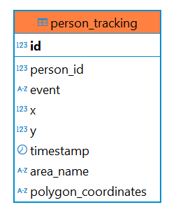

# Synapsis Person Tracking System

## Overview
.gif>)
This project is a **real-time person tracking system** using **YOLO, Norfair, PostgreSQL, and Flask**. It integrates Docker for easy deployment and scalability.

## Features

- **Real-time tracking** using YOLOv5nu.onnx and Norfair for tracking
- **PostgreSQL** database integration
- **Dockerized** setup for easy deployment
- **Flask API** for accessing tracking data

---
## Checklist Challange Features

1. Challenge 1 : Desain Database (Done)

    

    Notes: 
    The database consists of a single table, with aggregation performed directly in Python. 

2. Challenge 2 : Pengumpulan Dataset (Done)

    Malioboro_10_Kepatihan.stream: https://cctvjss.jogjakota.go.id/malioboro/Malioboro_10_Kepatihan.stream/playlist.m3u8

3. Challenge 3 : Object Detection & Tracking (Done)

    - Deteksi Orang (Human Detection) ✅

        Due to memory and resource constraints, I'm using Yolov5nu.onnx

    - Tracking & Counting using norfair ✅

        Norfair is used for its fast performance and lightweight memory and resource consumption

    - Dynamic Polygon Setting ✅

4. Challenge 5 : Integrasi Sistem (API & Dashboard) (Done)

    - API (Application Programming Interface) ✅
    - Dashboard (opsional & nilai plus) ✅

5. Challenge 6 : Deployment (Done)

    - Containerization (opsional & nilai plus) ✅
---

## Installation & Setup

### **1. Clone the Repository**

```bash
git clone https://github.com/alrappie/synapsis-challenger.git
cd YOUR_REPO
```

### **2. Environment Variables**

Create a `.env` file and configure your database credentials:

```env
DB_NAME=synapsis
DB_USER=postgres
DB_PASSWORD=123
DB_HOST=db
DB_PORT=5432
```

### **3. Run with Docker**

Ensure **Docker and Docker Compose** are installed, then run:

```bash
docker-compose up --build
```

This will:

- Build the Flask app inside a container
- Start a PostgreSQL database
- Create the necessary tables (`person_tracking`)

Notes:
- Wait for a few second for onnx model start running

### **4. Check Running Containers**

```bash
docker ps -a
```

---


## API Endpoints

| Endpoint             | Method | Description                  |
| -------------------- | ------ | ---------------------------- |
| `/api/stats/live`    | `GET`  | Get live tracking stats      |
| `/api/stats/` | `GET`  | Get historical tracking data |
| `/api/config/area` | `POST`  | Create a new polygon |

Example usage:

```bash
curl http://localhost:5000/api/stats/live
```
```bash
curl http://localhost:5000/api/stats/live?start_date=2025-02-17&end_date=2025-02-25&limit=30&offset=0
```
```bash
curl -X POST http://localhost:5000/api/config/area \
     -H "Content-Type: application/json" \
     -d '{"polygon": [[100, 200], [300, 400], [500, 600]], "name": "Restricted Zone"}'
```
---
Challenge started on February 18, 2025, and was completed on February 21, 2025.
